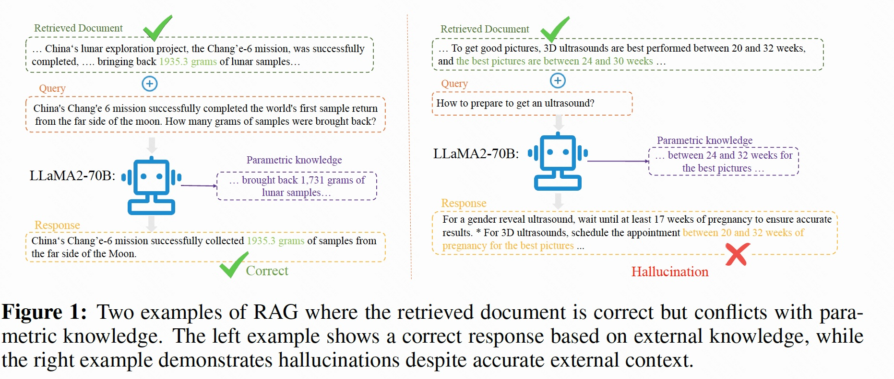
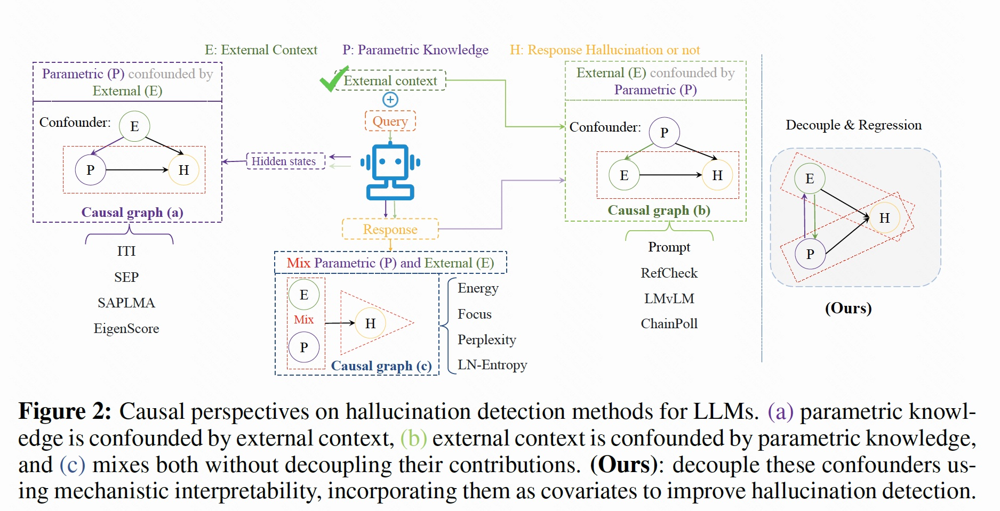

# ReDeEP

The implementation of the paper: "ReDeEP: Detecting Hallucination in Retrieval-Augmented Generation via Mechanistic Interpretability"

Retrieval-Augmented Generation (RAG) models are designed to incorporate external knowledge, reducing hallucinations caused by insufficient parametric (internal) knowledge. However, even with accurate and relevant retrieved content, RAG models can still produce hallucinations by generating outputs that conflict with the retrieved information. Detecting such hallucinations requires disentangling how Large Language Models (LLMs) balance external and parametric knowledge. Current detection methods often focus on one of these mechanisms or without decoupling their intertwined effects, making accurate detection difficult. In this paper, we investigate the internal mechanisms behind hallucinations in RAG scenarios. We discover that hallucinations occur when the **Knowledge FFNs** in LLMs overemphasize parametric knowledge in the residual stream, while **Copying Heads** fail to effectively retain or integrate external knowledge from retrieved content. Based on these findings, we propose **ReDeEP**, a novel method that detects hallucinations by decoupling LLM’s utilization of external context and parametric knowledge. Our experiments show that ReDeEP significantly improves RAG hallucination detection accuracy. Additionally, we introduce AARF, which mitigates hallucinations by rebalancing the contributions of Knowledge FFNs and Copying Heads. These methods demonstrate notable improvements in both hallucination detection and mitigation in RAG models.







# Reimplementation
**Requirements**
```bash
pip install -e transformers
pip install sentence_transformers 
```

Others see [requirements.txt](requirements.txt) if needed


**ReDeEP(Chunk) detection and regression**
```bash
!python ./ReDeEP/chunk_level_detect.py --model_name llama2-7b --dataset ragtruth
!python ./ReDeEP/chunk_level_reg.py --model_name llama2-7b --dataset ragtruth

```

**ReDeEP(Token) detection and regression**
```bash
!python ./ReDeEP/token_level_detect.py --model_name llama2-7b --dataset ragtruth
!python ./ReDeEP/token_level_reg.py --model_name llama2-7b --dataset ragtruth
```

**AARF generation and evaluation**
```bash
python ./AARF/truthful_answer_generate.py --model_name llama2-7b --AARF (baseline without AARF)
python ./AARF/truthful_evaluation.py --model_name llama2-7b
```


